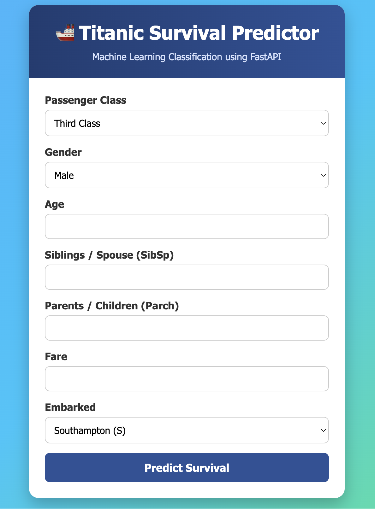

# Titanic Survival Prediction using FastAPI & Machine Learning

A complete end-to-end Machine Learning deployment project built using **Scikit-Learn**, **FastAPI**, **Joblib**, and **HTML/CSS/JavaScript**.

This project predicts whether a passenger would have survived the Titanic disaster based on passenger information. The machine learning model is exposed through a FastAPI REST API and includes a clean web interface for user interaction.

---

## Project Overview

This project demonstrates the complete Machine Learning deployment workflow, including:

- Data preprocessing
- Feature engineering
- Machine Learning pipeline creation
- Model training
- Model serialization using Joblib
- REST API development using FastAPI
- Interactive frontend using HTML, CSS, and JavaScript
- Cloud deployment on Render

The objective of this project is to demonstrate how a trained machine learning model can be deployed as a production-ready web application.

---


## Project Structure

```
Titanic-Survival-Prediction/
│
├── app.py
├── schema.py
├── model_training.ipynb
│
├── data/
│   └── titanic.csv
│
├── model/
│   └── titanic_pipeline.joblib
│
├── static/
│   └── index.html
│
├── requirements.txt
├── requirements-dev.txt
└── README.md
```

---

## Project Workflow

The project follows a complete Machine Learning workflow:

1. Load and explore the Titanic dataset.
2. Perform data preprocessing and handle missing values.
3. Encode categorical features.
4. Build a preprocessing pipeline.
5. Train a Logistic Regression classifier.
6. Save the complete preprocessing pipeline and trained model using Joblib.
7. Develop REST APIs using FastAPI.
8. Create a frontend interface for prediction.
9. Deploy the application on Render.

---

## Machine Learning Pipeline

The saved pipeline includes both preprocessing and model training.

### Preprocessing

- Missing value handling
- Categorical feature encoding
- Numerical feature transformation
- Pipeline integration

### Classification Model

- Logistic Regression

Saving the complete pipeline ensures that the API can directly accept raw user input without requiring additional preprocessing.

---

## Features Used

| Feature | Description |
|----------|-------------|
| Pclass | Passenger Class |
| Sex | Passenger Gender |
| Age | Passenger Age |
| SibSp | Number of Siblings or Spouse |
| Parch | Number of Parents or Children |
| Fare | Passenger Fare |
| Embarked | Port of Embarkation |

---

## Technologies Used

| Category | Technology |
|----------|------------|
| Programming Language | Python |
| Machine Learning | Scikit-Learn |
| Data Processing | Pandas, NumPy |
| Model Serialization | Joblib |
| Backend Framework | FastAPI |
| Validation | Pydantic |
| Frontend | HTML, CSS, JavaScript |
| API Server | Uvicorn |
| Deployment | Render |
| Version Control | Git & GitHub |

---

## API Endpoints

### Home Page

```
GET /
```

Returns the web application interface.

---

### Health Check

```
GET /health
```

Response

```json
{
    "status":"okk"
}
```

---

### Predict Passenger Survival

```
POST /predict
```

Request Body

```json
{
    "Pclass": 3,
    "Sex": "male",
    "Age": 22,
    "SibSp": 1,
    "Parch": 0,
    "Fare": 7.25,
    "Embarked": "S"
}
```

Successful Response

```json
{
    "prediction": 0,
    "label": "Did not survive",
    "confidence": 0.91
}
```

---

## Frontend

The application includes a responsive web interface that allows users to:

- Enter passenger information
- Submit prediction requests
- View prediction results
- Display model confidence score

The frontend communicates with the FastAPI backend using the JavaScript Fetch API.

---

## Running the Project Locally

### Clone the Repository

```bash
git clone https://github.com/datasciencekibaatein/Titanic-Survival-Prediction.git
```

```bash
cd Titanic-Survival-Prediction
```

---

### Create a Virtual Environment

#### Windows

```bash
python -m venv venv
```

#### macOS/Linux

```bash
python3 -m venv venv
```

---

### Activate the Virtual Environment

#### Windows

```bash
venv\Scripts\activate
```

#### macOS/Linux

```bash
source venv/bin/activate
```

---

### Install Dependencies

```bash
pip install -r requirements.txt
```

---

### Start the FastAPI Server

```bash
uvicorn app:app --reload
```

Open your browser and navigate to:

```
http://127.0.0.1:8000
```

---

## Deployment

The application is deployed on **Render**.

Deployment includes:

- FastAPI backend
- Machine Learning pipeline
- HTML frontend
- Automatic dependency installation
- REST API endpoints

---

## Learning Outcomes

This project demonstrates practical implementation of:

- Data preprocessing
- Feature engineering
- Machine Learning pipelines
- Logistic Regression
- Joblib model serialization
- REST API development
- FastAPI framework
- Pydantic validation
- Frontend-backend integration
- JavaScript Fetch API
- Cloud deployment
- Production-ready Machine Learning applications

---

## Future Improvements

Potential enhancements include:

- Support for multiple Machine Learning models
- Docker containerization
- CI/CD pipeline with GitHub Actions
- Unit testing
- Model monitoring
- Authentication and authorization
- Logging and error monitoring
- Database integration
- Swagger UI customization
- Automated model retraining

---

## Screenshots


### Home Page



### Prediction Result


---

## Repository

After cloning the repository, install the required dependencies and run the application locally.

```bash
git clone https://github.com/datasciencekibaatein/Titanic-Survival-Prediction.git

cd Titanic-Survival-Prediction

pip install -r requirements.txt

uvicorn app:app --reload
```

---

## Contributing

Contributions are welcome.

If you would like to improve the project, feel free to fork the repository and submit a pull request.

---

## License

This project is intended for educational and learning purposes.

---

## Author

**Dhruv**

Data Science Instructor

- Machine Learning
- Deep Learning
- Generative AI
- Model Deployment

GitHub: https://github.com/datasciencekibaatein

LinkedIn: https://www.linkedin.com/in/dhruv6397/